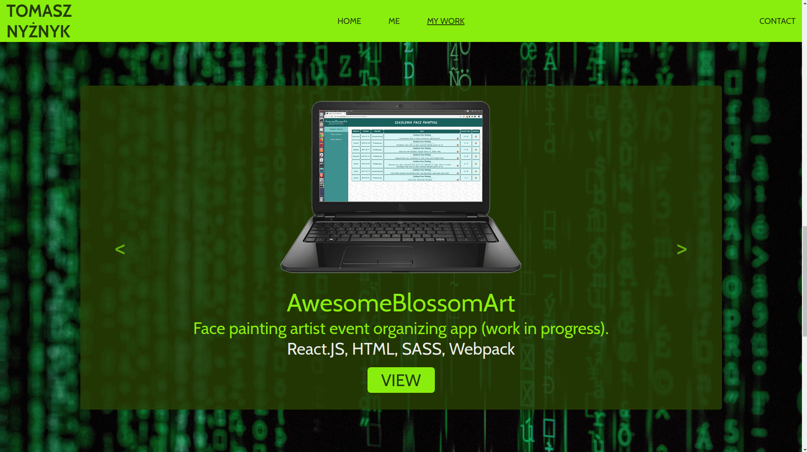

# Nyziek's (my) portfolio

Own project.

The aim of the project was to create a website with my developer's portfolio.

The website consists of 4 sections:
* Home (welcome page)
* Me (basic information on my previous career and experience)
* My Work (slider with my projects' descriptions and links to demos)
* Contact (e-mail, github, linkedin info)

Technologies used:
* JavaScript
* HTML
* Sass
* RWD
* Gulp

Preview:

https://nyziek.pl/

Screenshots:

